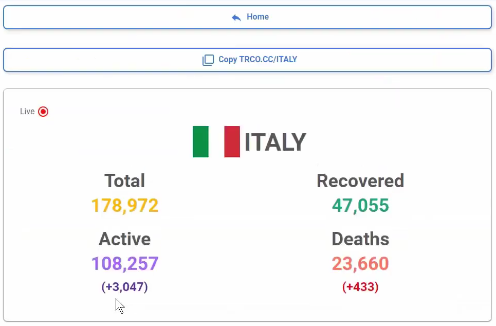

# Coronavirus Tracker

This was a website dedicated to tracking the COVID-19 pandemic. It featured live stats such as active cases, deaths and recoveries from over 200 countries worldwide. Visualizations were also provided to see a better picture.

The site had aggregated about 15,000 users over it's one month lifetime.

Demonstration: [YouTube Video](https://www.youtube.com/watch?v=HAUdK1UaFuc)

  

  

  

### Features Include:

- Ability to view Covid cases from over 150 countries worldwide
- Ability to filter by country, and in some cases, provinces/states too
- Ability to see recommendations to limit the spread of Covid
- Ability to see graphs and future projects of cases
- Ability to see latest news of country in regards to Covid

### Technologies Used:

- React
- Node.js
- Express.js
- MongoDB
- Web Scraping
